# Lowlands Lens — Solution Design

## 1. Document purpose

This document defines the target solution for a portfolio-grade multilingual retrieval-augmented generation system. It describes the problem, boundaries, architecture, data flow, retrieval logic, generation controls, evaluation, security, and local operating model.

It is a design specification, not an implementation. Technology choices marked **provisional** must be validated through an architecture decision or experiment before they become permanent.

## 2. Product definition

### 2.1 Working name

**Lowlands Lens**

### 2.2 Product goal

Build a French, Dutch, and English assistant that helps users discover and understand art, cultural heritage, and history connected to Belgium from 1900 to the present.

The assistant must retrieve relevant Europeana records, explain what the evidence supports, show object-level citations and source links, preserve rights information, and abstain when the collection does not contain enough evidence.

### 2.3 Learning goal

Use the project to practise production-oriented AI engineering and data science:

- source ingestion and data contracts;
- data quality, normalization, and versioning;
- information retrieval and ranking;
- multilingual embeddings and evaluation;
- grounded generation and citation validation;
- experimental design and error analysis;
- prompt-injection protection;
- local service design, testing, monitoring, and reproducibility.

### 2.4 Intended users

#### Primary users

- Students and educators exploring Belgian modern art and history
- Cultural-heritage enthusiasts interested in Belgium
- Researchers performing initial discovery across Europeana collections

#### Portfolio audience

- AI and machine-learning engineering recruiters
- Data-science and software-engineering hiring managers
- Technical reviewers evaluating RAG architecture, retrieval quality, evaluation, security, and reproducibility

The MVP is primarily a portfolio demonstration. It must therefore provide a useful cultural-heritage experience while making its engineering decisions, evidence, evaluation results, and limitations easy for technical reviewers to inspect.

### 2.5 Example questions

The following questions represent the intended search, comparison, multilingual, rights, and abstention behaviour of the assistant.

#### Art and artists

- Which Europeana objects document Belgian Surrealism between 1920 and 1970?
- Show records related to René Magritte and identify their providing institutions.
- Quels objets documentent l'Art nouveau à Bruxelles au début du XXe siècle ?
- Welke objecten tonen de ontwikkeling van moderne Belgische beeldhouwkunst na 1945?
- Find contemporary artworks connected to Belgium that were created after 2000.

#### Architecture and urban history

- Which objects document Art Nouveau architecture in Brussels between 1900 and 1914?
- How is Brussels represented in photographs before and after the Second World War?
- Toon objecten over de architectuur en het ontwerp van Expo 58.
- Compare records depicting Antwerp and Brussels during the 1950s and 1960s.

#### Historical events and social change

- What objects document the public memory of the First World War in Belgium?
- Which photographs, posters, or films illustrate Belgian life during the Second World War?
- Quels objets illustrent les changements sociaux en Belgique pendant les années 1960 ?
- What do retrieved records show about migration in Belgium after 1945?
- Which Europeana objects document protests or political movements in Belgium after 1960?

#### Colonial history and representation

- Which records document relationships between Belgium and the Congo between 1900 and 1960?
- Comment les descriptions des archives coloniales représentent-elles les populations congolaises ?
- Find colonial records whose metadata may require historical or bias-related context.
- Compare how colonial records are described by different providing institutions.

#### Media and cultural life

- Find Belgian posters related to exhibitions, politics, tourism, or public events between 1900 and 1950.
- Welke foto's en films documenteren de Belgische culturele scène in de jaren 1980?
- Show records about Belgian cinema and filmmakers during the 20th century.
- Which objects document changes in Belgian fashion or graphic design after 1945?

#### Rights-aware discovery

- Which retrieved images of Belgian modern art can be reused in a public presentation?
- Show public-domain photographs of Belgian architecture created before 1950.
- Find objects related to Expo 58 that permit reuse and explain the recorded rights conditions.

#### Unsupported or insufficient-evidence questions

- Who was objectively the most influential Belgian artist of the 20th century?
- What did all Belgians think about Expo 58?
- Which political movement had the greatest effect on Belgian culture?

For questions that require unsupported opinions, complete population-level conclusions, or evidence absent from the collection, the assistant must explain the limitation or abstain.

### 2.6 Domain boundary

#### Theme

The assistant covers Belgian art, cultural heritage, and history from 1900 to the present.

Relevant subjects include:

- Modern and contemporary visual art
- Photography
- Architecture and urban development
- Posters and graphic design
- Film, newsreels, and sound recordings
- Fashion and design
- War, occupation, and public remembrance
- Colonial and postcolonial history
- Migration
- Political and social movements
- Industry, work, and everyday life
- Belgian cultural institutions, events, and public figures

#### Geographical connection

A record is considered connected to Belgium when its source metadata explicitly indicates at least one of the following:

- The object was created in Belgium.
- The object depicts or describes a Belgian place.
- The subject is a Belgian person, institution, community, or event.
- The creator has an explicitly documented connection to Belgium.
- The object documents Belgian history or culture.

A record is not considered Belgian solely because it is held by a Belgian institution or has Belgium as its providing country.

The system must preserve the type of Belgian connection so users can distinguish where an object was created, what it depicts, who created it, and which institution holds it.

#### Period

The covered period begins on 1 January 1900 and continues to the date of the current corpus snapshot.

The relevant date is the date of the cultural object, depicted event, or documented subject—not the digitization date or the date the record was added to Europeana.

Undated records may be included when other source metadata clearly places them within the period, but they must be flagged as having an uncertain date.

Each corpus snapshot must record its upper date boundary so that “the present” remains reproducible.

#### Languages

The interface and generated answers support:

- Dutch
- French
- English

Metadata in other languages, including German, may be preserved and indexed when supplied by Europeana. Source values must not be discarded merely because their language is not one of the three interface languages.

#### Media

The collection may include metadata records for:

- Images
- Texts
- Sound
- Video
- 3D objects when relevant

The MVP retrieves objects through their metadata. Processing visual, audio, video, OCR, or 3D content directly is outside the initial retrieval boundary.

## 3. Scope

### 3.1 MVP scope

The MVP is a locally runnable, metadata-based RAG assistant for Belgian art and history from 1900 to the corpus snapshot date.

#### Core user journey

A user can:

1. Ask a question in Dutch, French, or English.
2. Retrieve relevant Europeana cultural-heritage objects.
3. Filter results using important structured metadata.
4. Receive an answer based only on the retrieved records.
5. Inspect the objects supporting the answer.
6. Open Europeana or provider source pages.
7. See the recorded rights information.
8. Receive a qualified answer or abstention when evidence is insufficient.

#### Corpus

- A bounded and reproducible snapshot of relevant Europeana records
- Europeana Search API for record discovery
- Europeana Record API for complete object metadata
- Preservation of immutable raw API responses
- Normalized Europeana Data Model fields
- Original multilingual metadata and language tags
- Traceability from normalized objects to raw source records
- Metadata for images, texts, sound, video, and relevant 3D objects

The initial corpus size will be chosen after source discovery and data-quality analysis.

#### Retrieval

- Object-level retrieval without arbitrary text chunking
- A transparent lexical-search baseline
- A multilingual vector-search baseline
- Deterministic hybrid rank fusion
- Filters for date, place, object type, language, provider, media type, and rights
- Retrieval scores and provenance available for inspection

A reranker is not required for the MVP unless evaluation demonstrates a meaningful improvement.

#### Answer generation

- Bounded evidence packages containing retrieved Europeana records
- Grounded answers in Dutch, French, or English
- Structured model output
- Object identifiers returned with supported claims
- Deterministic citation validation
- Citation labels and URLs constructed by the application
- Rights information displayed from normalized source data
- Evidence-based qualification or abstention
- Search-only results when answer generation is unavailable

#### Local product

- Versioned local API
- Local user interface
- Search and answer functionality
- Evidence and source inspection
- Clear loading, empty, error, limitation, and abstention states
- No user account required

#### Evaluation

- A small, versioned multilingual evaluation collection
- Human-reviewed relevance judgments
- Retrieval evaluation for lexical, vector, and hybrid approaches
- Grounding and citation evaluation
- Per-language results
- Supported and unsupported test questions
- Basic prompt-injection and fabricated-citation tests

#### Engineering quality

- Reproducible local environment
- Docker Compose for persistent services
- Secure local credential handling
- Deterministic and versioned transformations
- Automated unit, integration, contract, and retrieval tests
- Structured diagnostic logging
- Documented setup, architecture, experiments, and limitations

### 3.2 Deferred capabilities

The following capabilities are outside the MVP. They may be considered after the metadata-based RAG system is working, evaluated, and documented.

#### Direct media understanding

- OCR for newspapers, books, letters, posters, and scanned documents
- Long-document extraction and chunking
- Image embeddings and visual similarity search
- Generated image descriptions
- Audio transcription and audio-content search
- Video transcription, frame extraction, and video-content search
- Direct analysis of 3D objects

The MVP may retrieve these objects using Europeana metadata, but it does not interpret their media content directly.

#### External enrichment

- Wikidata enrichment
- Wikipedia or general web evidence
- Scraping provider websites
- Combining Europeana evidence with unrelated external collections
- Automatic entity linking to external knowledge bases

Europeana records remain the only factual evidence source for the MVP.

#### Advanced retrieval

- Learned rank fusion
- Cross-encoder reranking, unless evaluation demonstrates a meaningful benefit
- Automatic query expansion
- Automatic query translation
- Personalized recommendations
- User-specific ranking

#### Product expansion

- User accounts
- Saved searches and personal collections
- Collaboration and annotation features
- Mobile applications
- Public cloud hosting
- Multi-user production deployment
- Role-based access control

#### Infrastructure expansion

- Kubernetes
- Distributed ingestion
- Distributed vector databases
- Real-time or continuously scheduled ingestion
- Production-scale autoscaling
- Cloud monitoring infrastructure

#### Model customization and autonomy

- Model fine-tuning
- Embedding-model fine-tuning
- Autonomous agents
- General web browsing
- Model-controlled external tools

A deferred capability may enter the roadmap only when:

1. The working MVP has been evaluated.
2. A specific user or quality problem justifies it.
3. The required data and rights are available.
4. Its expected benefit can be measured.
5. Its added operational cost is understood.

## 4. Evidence and trust boundary

### 4.1 Permitted evidence

Europeana object records are the only factual evidence source for the MVP.

The system may use the following stored fields from an included Europeana record:

- Europeana object identifier
- Original and normalized titles
- Descriptions
- Subjects
- Creators and contributors
- Object types and media types
- Dates and original date strings
- Places
- Provider and data-provider information
- Rights statements
- Europeana object links
- Original institution links
- Other explicitly mapped Europeana Data Model fields

The Search API is used to discover records. Before a record is supplied as answer evidence, its complete metadata must be retrieved through the Record API and stored with provenance.

Europeana editorial stories, model pretraining knowledge, Wikipedia, Wikidata, general web pages, and unstored provider-page content are not factual evidence for the MVP.

Europeana aggregates metadata supplied by many institutions. A Europeana record is therefore treated as attributed collection evidence, not as an infallible historical authority.

### 4.2 Evidence provenance

Every evidence record must be traceable to:

- Its Europeana identifier
- The raw API response
- The ingestion run
- The retrieval timestamp
- The source request
- A content checksum
- The normalization version
- The retrieval-document version

The system must distinguish:

- Values supplied by the source
- Deterministically normalized values
- Derived values
- Model-generated values

Generated translations, summaries, classifications, and descriptions must be labelled as derived data. They must never overwrite or be presented as original source metadata.

### 4.3 Claim policy

Answers may make only claims supported by the supplied evidence package.

The assistant must:

- Attribute object-specific facts to the relevant record.
- Cite every substantive claim.
- Cite records representing each side of a comparison.
- Distinguish source metadata from its own synthesis.
- Use qualified wording when evidence is partial.
- Clearly identify conflicting or ambiguous metadata.
- Preserve historically sensitive wording only when needed for accurate attribution and context.

The assistant must not:

- Use model memory to add unsupported historical facts.
- Infer public opinion from a small set of objects.
- Treat the number of retrieved records as proof of historical importance or prevalence.
- Claim that an object is representative of all Belgian society without supporting evidence.
- Convert a provider description into an unquestioned historical conclusion.
- Invent people, dates, places, institutions, quotations, identifiers, or URLs.

For broad questions, answers should use formulations such as “the retrieved records show” rather than claiming to provide a complete account of Belgian history.

### 4.4 Citation policy

Citations are controlled by the application rather than generated freely by the model.

The generation model may return only object identifiers present in its evidence package.

The application must:

1. Validate every returned identifier against the evidence package.
2. Reject or repair unknown identifiers.
3. Construct citation labels from stored metadata.
4. Construct Europeana and provider URLs from stored values.
5. Check that substantive claims contain citations.
6. Prevent invalid citations from reaching the user.

A comparative claim must cite evidence for every compared subject. A citation must support the claim beside which it appears; topical similarity alone is insufficient.

### 4.5 Rights evidence

Metadata rights and digital-object rights must be treated separately.

Rights statements must come from normalized source metadata. The model must not infer reuse permission.

When rights information is missing, unclear, or conflicting, the assistant must state that the reuse status is unknown. Missing rights information must never be interpreted as permission to reuse an object.

Rights information must remain visible independently of the generated answer.

### 4.6 Insufficient or conflicting evidence

The assistant must qualify its response or abstain when:

- No relevant records are retrieved.
- Retrieved records do not support the requested claim.
- Essential dates, places, people, or relationships are missing.
- Evidence is too weak for a reliable synthesis.
- Records materially contradict one another.
- Citation validation fails.
- The question requires a subjective or population-wide conclusion unavailable from the collection.

When records conflict, the assistant may describe the disagreement and cite the conflicting records. It must not silently choose one version.

Search results should remain available when answer generation is unavailable or when the system abstains.

### 4.7 Untrusted retrieved content

All retrieved metadata is untrusted content.

Instructions appearing inside titles, descriptions, subjects, or other record fields must never change application or model behaviour.

Controls must include:

- Structural separation between instructions and evidence
- Explicit labelling of evidence as untrusted
- Bounded evidence packages
- Structured model output
- Identifier allowlisting
- Deterministic URL and rights handling
- No arbitrary tools exposed to the answer model
- Adversarial records included in testing

## 5. Requirements

### 5.1 Functional requirements

| ID | Requirement |
|---|---|
| FR-01 | Discover records through the Europeana Search API using reproducible query configurations. |
| FR-02 | Retrieve complete object metadata through the Europeana Record API. |
| FR-03 | Preserve raw responses, source identifiers, request parameters, timestamps, checksums, and versions. |
| FR-04 | Normalize multilingual EDM fields without discarding original values or language tags. |
| FR-05 | Determine and preserve explicit Belgian connection roles and temporal-scope evidence without using provider country as a substitute for subject geography. |
| FR-06 | Retrieve objects through lexical search, vector similarity, and deterministic hybrid ranking. |
| FR-07 | Apply structured temporal, geographical, provider, object-type, language, media, and rights filters. |
| FR-08 | Accept questions and answer in English, French, or Dutch according to the user's language or explicit preference. |
| FR-09 | Build bounded evidence packages only from stored complete Europeana records. |
| FR-10 | Support substantive answer claims with retrieved Europeana object identifiers. |
| FR-11 | Validate cited identifiers against supplied evidence and construct citation labels and URLs from stored data. |
| FR-12 | Display provider, source-link, and digital-object rights information for every cited object. |
| FR-13 | Abstain or qualify the answer when evidence is missing, weak, ambiguous, or contradictory. |
| FR-14 | Expose retrieval scores, selected evidence, pipeline versions, transformations, and latency for evaluation. |
| FR-15 | Continue providing inspectable search results when answer generation is unavailable or the system abstains. |
| FR-16 | Represent successful, empty, error, limitation, abstention, and dependency-unavailable states through the API and interface. |
| FR-17 | Support full corpus rebuilds and idempotent refresh ingestion from recorded source configurations. |
| FR-18 | Preserve and display whether a value is source-supplied, normalized, or derived. |

### 5.2 Non-functional requirements

| ID | Requirement |
|---|---|
| NFR-01 | Persistent application infrastructure runs locally. |
| NFR-02 | The local service stack is reproducible through Docker Compose. |
| NFR-03 | Credentials never appear in source control, logs, URLs, or generated artifacts. |
| NFR-04 | Raw, normalized, derived, evaluation, and runtime data have separate ownership boundaries. |
| NFR-05 | Transformations are deterministic, versioned, and traceable to source records. |
| NFR-06 | Retrieval experiments record dataset, index, model, configuration, code, and metric versions. |
| NFR-07 | Components communicate through small typed interfaces. |
| NFR-08 | Unit, integration, data-contract, retrieval, answer, and adversarial tests are automated. |
| NFR-09 | Failures contain enough diagnostic context to reproduce the affected pipeline step. |
| NFR-10 | The system distinguishes process liveness from dependency readiness. |
| NFR-11 | Public API contracts are versioned and mock implementations can be replaced without changing user-visible semantics. |
| NFR-12 | A clean local installation and representative demonstration run are documented and reproducible. |

## 6. External data sources

### 6.1 Europeana Search API

Base endpoint:

```text
https://api.europeana.eu/record/v2/search.json
```

Purpose:

- discover records;
- apply queries and refinements;
- inspect provider, dataset, country, language, type, year, and rights facets;
- collect Europeana record identifiers;
- paginate through a result set using cursors.

### 6.2 Europeana Record API

Endpoint pattern:

```text
https://api.europeana.eu/record/v2/{DATASET_ID}/{LOCAL_ID}.json
```

Purpose:

- retrieve the complete EDM representation of one cultural object;
- obtain original multilingual values;
- obtain provider, aggregation, rights, media, and landing-page information.

### 6.3 Original cultural institutions

Europeana is an aggregation layer. The original records come from museums, archives, libraries, universities, and other cultural institutions. The system must retain:

- the Europeana record identifier;
- the Europeana object page;
- the data provider;
- intermediate provider or aggregator where present;
- the original institution landing page where present.

The provider list will be selected after a data-quality and facet analysis rather than fixed in advance.

### 6.4 Rights vocabularies

Europeana metadata is available under CC0, while linked digital objects and previews have their own rights statements. The system must treat metadata rights and digital-object rights separately.

Relevant documentation:

- [Europeana APIs](https://pro.europeana.eu/page/apis)
- [Accessing the Europeana APIs](https://europeana.atlassian.net/wiki/spaces/EF/pages/2462351393/Accessing%2Bthe%2BAPIs)
- [Search API documentation](https://europeana.atlassian.net/wiki/spaces/EF/pages/2385739812)
- [Record API documentation](https://europeana.atlassian.net/wiki/spaces/EF/pages/2385674279/Record%2BAPI%2BDocumentation)
- [Metadata usage guidelines](https://www.europeana.eu/eu/rights/usage-guidelines-for-metadata)
- [Europeana rights statements](https://pro.europeana.eu/page/available-rights-statements)

## 7. High-level architecture

```mermaid
flowchart LR
    search[Europeana Search API] --> bronze[Bronze: immutable JSON]
    record[Europeana Record API] --> bronze
    bronze --> silver[Silver: normalized EDM]
    silver --> quality[Data-quality validation]
    quality --> catalog[PostgreSQL catalog]
    catalog --> gold[Gold: retrieval documents]

    user[User] --> ui[Local interface]
    ui --> api[Versioned local API]
    api --> query[Language, filters, and query processing]
    query --> lexical[Lexical retrieval]
    query --> vector[Vector retrieval]
    gold --> lexical
    gold --> vector
    lexical --> fusion[Reciprocal Rank Fusion]
    vector --> fusion
    fusion --> optional[Optional evaluated reranker]
    optional --> evidence[Evidence, provenance, and rights validation]
    evidence --> sufficient{Evidence sufficient?}
    sufficient -->|No| response[Search results with limitation or abstention]
    sufficient -->|Yes| generation[Grounded answer generation]
    generation --> citation[Deterministic citation validation]
    citation --> response
    response --> api

    fusion --> evaluation[Retrieval evaluation]
    response --> evaluation
    api --> monitoring[Local diagnostics and metrics]
```



## 8. Data architecture

### 8.1 Bronze layer

Contents:

- complete Search API responses;
- complete Record API responses;
- request configuration;
- retrieval timestamp;
- HTTP status and retry history;
- content checksum.

Properties:

- immutable;
- append-only;
- compressed local JSON;
- reproducible and independent of transformation code.

### 8.2 Silver layer

Contents:

- normalized Europeana identifiers;
- multilingual titles, descriptions, subjects, creators, and types;
- parsed dates plus original date strings;
- normalized places and coordinates where available;
- explicit Belgian connection roles and supporting source fields;
- provider relationships;
- rights URIs and categories;
- media and landing-page references;
- data-quality flags.

Format:

- versioned Parquet for analysis and repeatable transformations;
- validated tables loaded into PostgreSQL for serving.

### 8.3 Gold layer

Contents:

- object-level retrieval documents;
- language-specific retrieval text;
- filterable structured attributes;
- lexical search representation;
- embeddings and embedding metadata;
- evaluation snapshots.

Gold data is derived. It can be rebuilt from Bronze and Silver when retrieval logic changes.

## 9. PostgreSQL design

PostgreSQL is the serving system of record for the current normalized collection. Raw API files remain the replay source.

Proposed namespaces:

| Namespace | Responsibility |
|---|---|
| `ingestion` | Runs, source requests, checksums, raw-file locations, and record versions |
| `catalog` | Objects, multilingual text, dates, places, providers, rights, and media |
| `retrieval` | Retrieval documents, lexical features, embeddings, and index metadata |
| `evaluation` | Questions, relevance labels, answer labels, experiment runs, and metrics |
| `observability` | Query events, retrieved candidates, generated answers, failures, and latency |

Key conceptual tables:

- `ingestion.runs`
- `ingestion.record_versions`
- `catalog.objects`
- `catalog.object_texts`
- `catalog.providers`
- `catalog.object_providers`
- `catalog.rights_statements`
- `catalog.media_resources`
- `retrieval.documents`
- `retrieval.embeddings`
- `evaluation.queries`
- `evaluation.relevance_judgments`
- `evaluation.experiment_runs`
- `observability.query_events`

Multilingual values should be stored as separate rows with language codes, not flattened into one text column. Generated translations must carry an origin marker and must never overwrite source metadata.

## 10. Retrieval design

### 10.1 Retrieval unit

The initial unit is one cultural object. Europeana records are structured metadata objects, not long documents. Arbitrary token chunking would weaken field meaning and citation provenance.

Chunking is introduced only when long OCR or extended text sources are added.

### 10.2 Query processing

The query pipeline will:

1. Preserve the original user query.
2. Detect or accept the query language.
3. Extract explicit structured filters.
4. Run a lexical and dense baseline without silent query rewriting.
5. Record translation or expansion as a post-MVP experiment when evaluation shows a justified need.

Every transformation must be logged for reproducibility.

### 10.3 Lexical retrieval

The lexical baseline measures exact terms, names, places, occupations, and dates. Native PostgreSQL full-text search is a possible first baseline, but its ranking is not BM25. A BM25-capable extension or separate search engine is a later decision based on measured benefit and local operational cost.

### 10.4 Dense retrieval

Dense retrieval uses multilingual embeddings to capture semantic similarity across English, French, and Dutch. Embedding model, vector dimension, input text construction, and normalization are experiment parameters, not hidden implementation details.

### 10.5 Hybrid fusion

Lexical and dense result lists will first be combined with Reciprocal Rank Fusion because it:

- combines ranks without assuming comparable score scales;
- is deterministic and easy to inspect;
- provides a strong baseline before learned fusion.

### 10.6 Reranking

A multilingual cross-encoder or equivalent reranker may evaluate the top fused candidates. It is not required for the MVP and is adopted only if it improves held-out relevance metrics enough to justify latency and complexity.

### 10.7 Evidence package

The generator receives a bounded evidence package containing:

- stable object identifier;
- original and normalized metadata;
- language information;
- provider and source links;
- rights information;
- retrieval provenance and reranking provenance when reranking is used.

## 11. Answer generation and citations

The generation step will use a structured response contract containing:

- answer text;
- cited object identifiers;
- optional limitations;
- abstention status and reason.

The application will:

1. Check that every returned identifier exists in the evidence package.
2. Reject or repair unknown identifiers.
3. Construct citation labels and URLs from the database.
4. Ensure that claims requiring evidence have citations.
5. Display rights information independently from the generated answer.

The model is never trusted to invent or format authoritative URLs.

## 12. Multilingual strategy

- Preserve all source language tags.
- Preserve metadata in languages outside the three interface languages, including German where present.
- Index original metadata in its source language.
- Evaluate lexical retrieval separately by language.
- Evaluate cross-language dense retrieval.
- Use generated translations only as labelled derived data.
- Test answer language independently from retrieval relevance.
- Include questions whose language differs from the relevant record language.

This distinguishes three different problems: multilingual metadata, cross-language retrieval, and multilingual answer generation.

## 13. Abstention design

Abstention will not depend solely on a prompt instruction.

Signals may include:

- candidate relevance and score distribution;
- reranker confidence;
- evidence coverage for the requested entities, dates, and places;
- contradiction or ambiguity flags;
- citation completeness;
- an evidence-sufficiency judgment.

Thresholds must be calibrated on supported and unsupported evaluation questions. The target is useful selective answering, not maximum refusal.

## 14. Security design

### 14.1 Prompt injection

Retrieved titles, descriptions, provider text, and any future OCR are untrusted evidence. Instructions embedded in that material must never change system behavior.

Controls:

- separate instructions from evidence structurally;
- label evidence as untrusted content;
- use bounded structured output;
- do not expose arbitrary tools to the answer model;
- validate citation identifiers and URLs deterministically;
- include malicious-record tests in the evaluation suite.

### 14.2 External access

- Send Europeana keys in headers, not query strings.
- Store secrets only in ignored local environment files.
- Allowlist external hosts if provider content is fetched later.
- Apply timeouts, size limits, content-type checks, and retry budgets.
- Do not log credentials or complete authorization headers.

## 15. Evaluation design

### 15.1 Retrieval evaluation

Metrics:

- Recall@k
- Precision@k
- Mean Reciprocal Rank
- nDCG@k
- language and filter-slice results

Experiment ladder:

1. Lexical baseline
2. Dense baseline
3. Hybrid fusion
4. Hybrid plus reranking

Query translation or expansion remains a post-MVP experiment unless the scope is explicitly revised.

### 15.2 Answer evaluation

Dimensions:

- evidence grounding;
- citation correctness and completeness;
- factual consistency with retrieved records;
- language correctness;
- rights accuracy;
- useful abstention;
- clarity and relevance.

Human labels remain necessary. A model-based evaluator may assist but cannot be the sole judge.

### 15.3 Initial targets

These are hypotheses to revise after baseline measurement:

| Metric | Initial target |
|---|---:|
| Recall@10 | >= 0.85 |
| nDCG@10 | >= 0.75 |
| Lowest-language Recall@10 | >= 0.75 |
| Cross-language Recall@10 | >= 0.70 |
| Citation precision | >= 0.95 |
| Citation completeness | >= 0.90 |
| Grounded-answer rate | >= 0.90 |
| Answer-language accuracy | >= 0.98 |
| Rights-source accuracy | 1.00 |
| Unsupported-question abstention F1 | >= 0.80 |
| Invalid citation rate | 0 |
| Successful prompt-injection attacks in the regression set | 0 |

Results must also be reported separately for Dutch, French, English, cross-language questions, rights questions, and unsupported questions. Latency and model cost are measured from the first baseline; final budgets are set only after those measurements exist.

## 16. Observability

Record for each request:

- query and detected language;
- extracted filters;
- query transformations;
- lexical and vector candidates;
- fusion results and reranking results when reranking is used;
- selected evidence;
- model and prompt versions;
- citation-validation result;
- abstention decision;
- component latency, token usage, and failure category.

Logs must support debugging without storing secrets. Monitoring is local and should distinguish data problems, retrieval problems, generation problems, dependency failures, and user-input failures.

## 17. Local deployment model

Provisional service boundaries:

- Python ingestion and transformation jobs
- PostgreSQL with pgvector
- FastAPI application service
- Local user interface
- Local evaluation runner
- Local metrics and experiment tracking

Docker Compose is the target local deployment mechanism. Exact services are introduced only when their phase begins.

## 18. Decisions intentionally deferred

- PostgreSQL-only lexical search versus a BM25-capable engine
- OpenAI embeddings versus a local multilingual embedding model
- Exact generation model
- Exact reranker
- A later interface framework only if the Phase 2 static interface cannot meet
  measured product needs
- MLflow versus a lighter experiment store
- Prometheus/Grafana versus application-native metrics

Each choice will be made using an architecture decision record or benchmark, not convenience alone.

## 19. Definition of solution success

The solution succeeds when:

- users can discover Belgian art and historical objects dated from 1900 to the recorded corpus snapshot boundary;
- its corpus can be rebuilt from recorded source inputs;
- retrieval improvements are demonstrated on held-out judgments;
- generated answers remain inside the evidence boundary;
- citations and rights are deterministically valid;
- unsupported questions are handled safely;
- English, French, and Dutch behavior is evaluated separately;
- search results remain usable when generation is unavailable or the assistant abstains;
- the interface exposes evidence, providers, rights, and limitations clearly;
- a new developer can run, inspect, test, and understand the system locally.
